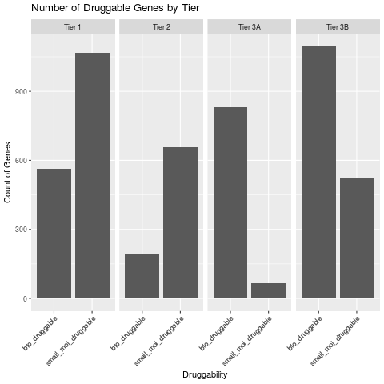

The activity of most pharmaceuticals is ultimately dependent on binding between the three-dimensional folded structure of bodily proteins and the tailored structure of the drug under study. Within the past two decades two parallel trends have had major impacts on drug development: the development of monoclonal antibody therapies, also called biopharmaceuticals and next-generation sequencing. Antibody binding targets represent a huge increase in the number of druggable targets in the body. Next generation sequencing technologies, on the other hand, have led to a deepening of our knowledge of druggable targets. We call the collection of protein-coding genes susceptible to drug binding the druggable genome. 

The first attempts to catalog the druggable genome were limited to small-molecules. These early efforts focused on the identification of recurrent binding motifs across gene families [@hopkins_druggable_2002]. To do this, they first identified common motifs in the binding targets of approved drugs. They then located similar patterns in related genes throughout the genome. 

One shortcoming of this approach was the lack of specificity for genes associated with disease. Attempts to integrate knowledge about genes associated with disease began with genome wide association studies (GWAS). Working initially with DNA microarray data, researchers queried the genomes of huge cohorts of affected individuals for a wide range of diseases. Initially, the prevailing hypothesis of disease inheritance was that relatively few variants with large effects might cause disease. Since that time, scientists have found almost no instances of such rare variants with large effect. Instead, genetic models of disease have typically involved polygenic inheritance of multiple variants that each contribute in a small way to disease. Nevertheless, a wealth of disease-specific sequencing datasets has been opened to the research community through these efforts.

By using information from GWAS, the range of druggable targets in the genome can be expanded. In recent years, researchers have attempted to confirm the mechanism of action of approved drugs by relating single-nucleotide polymorphisms (SNPs) correlated with the disease state to the putative drug target of recommended therapies [@finan_druggable_2017]. To relate SNPs to genes, the authors stratified SNPs into tiers, prioritizing those with only a single gene found within a minimum number of base pairs of the GWAS SNP. Additionally, they included newly approved biologics. After identifying the gene annotation with the minimum number of base pair difference from a given SNP, they related differences in SNP frequency in the population with functional changes involved in disease. (Figure 1)

There is a roughly equal number of small-molecule and biotherapeutic candidates represented in the druggable genome, with variation across tiers. Figure original, data from [@finan_druggable_2017]

It is challenging to correlate SNPs associated with disease to druggable targets partly because the vast majority are found in unannotated, noncoding or intronic sites. As such, they have no obvious impact on protein binding. Rather than influencing protein-binding SNPs are thought to impact the initial transcription and RNA expression of disease-related genes. The larger effects, however, may be identical to drug-binding—inactivation of a functional protein. As genomics becomes more data-rich, it will be important to mine results like these. One example is The Drug Gene Interaction Database (DGIdb), which relates interactions between the most recent genomic databases such as the Cancer Genome Atlas (TCGA) and clinically actionable targets derived from approved drugs and ongoing clinical trials [@wagner_dgidb_2016].

The search for the druggable genome—physical binding targets for drug development—represents one approach to bringing pharmaceuticals into the genomic era. An alternative model of drug activity proposes that therapies perturb whole networks of genes through indirect effects. This approach is motivated by findings that fold-change in protein expression of drug-targets in treated cells has rarely been found to be sufficient to explain observed phenotypes. Though sacrificing the directness of physical binding measures, there are several advantages to a network model: 1) off-target effects can be better modeled with a network theory 2) tissue-specific contexts may be more thoroughly described 3) the gap between drug target protein expression and phenotype may be better bridged. A network measure of drug activity can account for both direct and indirect drug targets. One example of such a network model is described by Isik et. al. They describe a new measure of perturbation in response to drug treatment, local radiality, which accounts for changes in both gene expression of binding targets and regulatory network organization [@isik_drug_2015]. 

Given the practical constraints of drug development, a relatively small subset of well-studied targets with known network interactions are typically targeted. When compared exclusively to such well-studied drug targets , local radiality recovers up to 50% of predicted targets. Predictive power rapidly declines when the search is expanded to all physically binding drug targets. It is somewhat unclear whether this is due to a bias towards subtle network effects or insufficiently annotated regulatory networks. It is reasonable that well-studied genes should have a better characterized regulatory network that is more robust to predictive methods. With the cost of sequencing falling and the current flood of transcriptome data, such a measure of drug activity may find strong adoption.

Pharmaceutical development has experienced a dramatic shift with the advent of high-throughput, next-generation sequencing (NGS). We have shown how the integration of GWAS data can help to better define the druggable genome. This has had important effects on our understanding of drug-protein interactions. In the coming years, it will be important to understand deeper complexity of the human genome. Projects to define gene expression network effects will continue to be important in understanding drug targets and for improving patient outcomes [@napolitano_gene2drug:_2017].
